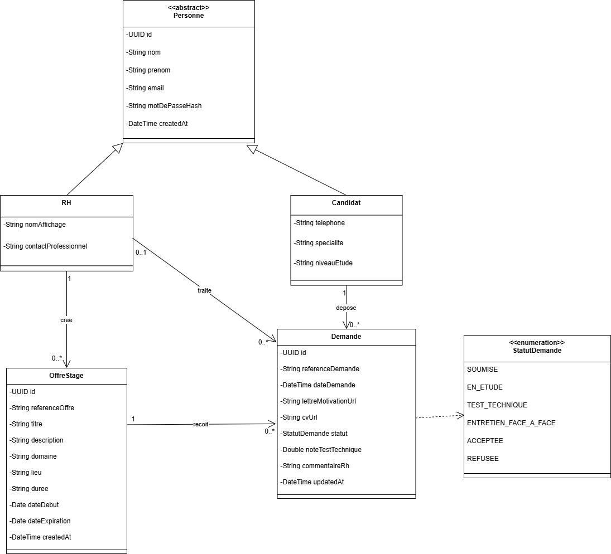

## Cahier des charges — Plateforme RH RIF Stages

### 1. Contexte du projet

Le projet correspond à l’axe **Flux de Travail** inspiré de **RIF-Stages** : formulaire de dépôt de candidature, workflow de validation RH et notification automatique.

Le challenge demande un **MVP fonctionnel en 2 jours** avec maquette, modèle de données, développement, automatisation et démo finale.

L’objectif est de créer une application permettant aux candidats de déposer des demandes de stage, et aux RH de gérer les offres, analyser les candidatures, changer les statuts et contacter les candidats.

---

### 2. Objectif général

Développer une plateforme RH simple pour gérer les candidatures de stage.

Le système doit permettre :

* aux candidats de consulter les offres de stage ;
* aux candidats de déposer une demande de stage ;
* aux candidats d’ajouter un lien Google Drive vers leur CV ;
* aux candidats d’ajouter une lettre de motivation optionnelle ;
* aux RH de créer et gérer les offres de stage ;
* aux RH de consulter les demandes reçues ;
* aux RH d’analyser les candidatures avec un assistant IA ;
* aux RH de modifier le statut d’une demande ;
* aux RH de sélectionner des candidats et préparer un email ;
* au système d’envoyer des notifications aux candidats en cas d’acceptation ou de refus.

---

### 3. Acteurs du système

#### 3.1 Candidat

Le candidat peut :

* créer un compte ;
* se connecter ;
* consulter les offres de stage disponibles ;
* déposer une demande pour une offre ;
* ajouter un lien Google Drive vers son CV ;
* ajouter une lettre de motivation optionnelle ;
* suivre le statut de sa demande.

#### 3.2 RH

Le responsable RH peut :

* se connecter ;
* créer, modifier et supprimer des offres de stage ;
* consulter les candidatures reçues ;
* consulter les informations des candidats ;
* analyser les CV et demandes avec un assistant IA ;
* attribuer une note ou un score à une candidature ;
* changer le statut d’une demande ;
* sélectionner plusieurs candidats ;
* ouvrir Gmail ou une application mail avec les emails préparés ;
* envoyer manuellement l’email après vérification.

---

### 4. Besoins fonctionnels

#### 4.1 Gestion des comptes

Le système doit permettre :

* l’inscription d’un candidat ;
* la connexion d’un candidat ;
* la connexion d’un responsable RH ;
* la séparation des accès selon les rôles : Candidat ou RH.

---

#### 4.2 Gestion des offres de stage

Le RH peut :

* créer une offre de stage ;
* modifier une offre existante ;
* supprimer une offre ;
* consulter la liste des offres ;
* définir les informations principales :

  * titre ;
  * description ;
  * domaine ;
  * lieu ;
  * durée ;
  * date de début ;
  * date d’expiration.

Le candidat peut :

* consulter les offres disponibles ;
* voir le détail d’une offre ;
* déposer une demande pour une offre.

---

#### 4.3 Gestion des demandes de stage

Une demande représente la candidature d’un candidat à une offre de stage.

Chaque demande contient :

* la date de dépôt ;
* le lien Google Drive du CV ;
* le lien Google Drive de la lettre de motivation ;
* le statut de la demande ;
* la note du test technique ;
* la date d’entretien ;
* le commentaire RH ;
* la date de dernière modification.

Correction importante :
Le **CV** et la **lettre de motivation** appartiennent à la classe **Demande**, car ils sont liés à une candidature précise, pas directement au profil général du candidat.

---

#### 4.4 Workflow de candidature

Le workflow principal est le suivant :

1. Le RH crée une offre de stage.
2. Le candidat consulte les offres disponibles.
3. Le candidat dépose une demande.
4. Le candidat ajoute :

   * le lien Google Drive de son CV ;
   * une lettre de motivation optionnelle.
5. Le RH consulte les demandes reçues.
6. Le RH peut lancer une analyse IA.
7. Le système propose une évaluation ou un score.
8. Le RH prend la décision finale.
9. Le RH change le statut :

   * en attente ;
   * acceptée ;
   * refusée ;
   * entretien ;
   * test technique.
10. Le candidat reçoit une notification.

---

#### 4.5 Assistant IA RH

L’application peut intégrer un assistant IA pour aider le RH à analyser les candidatures.

L’assistant IA peut :

* analyser le contenu du CV à partir du lien fourni ;
* comparer le profil du candidat avec l’offre ;
* générer un résumé du profil ;
* proposer une note ou un score ;
* donner une recommandation :

  * profil adapté ;
  * profil moyen ;
  * profil non adapté.

Technologies possibles :

* Gemini / Vertex AI ;
* Groq ;
* autre API IA compatible.

La décision finale reste toujours validée par le RH.

---

#### 4.6 Envoi d’email via Gmail ou application mail

Pour éviter la complexité d’un serveur SMTP, l’application peut utiliser une solution simple :

1. Le RH sélectionne un ou plusieurs candidats.
2. Le RH clique sur le bouton **Envoyer email**.
3. L’application ouvre Gmail ou l’application mail.
4. Les destinataires sont automatiquement ajoutés.
5. Le sujet et le contenu de l’email sont préremplis.
6. Le RH vérifie le contenu.
7. Le RH clique lui-même sur **Envoyer**.

Cette approche est simple, gratuite et adaptée à un MVP.

---

#### 4.7 Notifications candidats

Le système peut envoyer une notification au candidat lorsque le statut de sa demande change.

Exemples :

* candidature acceptée ;
* candidature refusée ;
* entretien programmé ;
* test technique demandé.

Technologie possible :

* Firebase Cloud Messaging, FCM.

---

### 5. Besoins non fonctionnels

Le système doit être :

* simple à utiliser ;
* responsive web et mobile ;
* sécurisé avec authentification ;
* clair pour les RH et les candidats ;
* rapide pour la consultation des demandes ;
* maintenable ;
* facilement déployable ;
* versionné avec Git.

---

### 6. Choix technologiques et architecture

Les choix technologiques retenus pour le MVP sont détaillés dans le document suivant :

- [`choix-technologiques.md`](./choix-technologiques.md)

L’architecture technique du projet est détaillée dans le document suivant :

- [`architecture-technique.md`](./architecture-technique.md)

Résumé :

| Partie | Choix |
|---|---|
| Frontend | Angular + PrimeNG Sakai |
| Backend | Spring Boot |
| Base de données | PostgreSQL |
| Sécurité | Spring Security + JWT |
| IA | Gemini / Vertex AI ou Groq |
| Notification | Firebase FCM |
| Email | Gmail / mailto |
| Déploiement | Docker + Docker Compose |

---

### 7. Modèle de données

Le modèle de données est basé sur les classes suivantes :

* Personne ;
* Candidat ;
* RH ;
* OffreStage ;
* Demande ;
* StatutDemande.

Le diagramme de classes doit être conservé sans modification.

Point important :

* `cvUrl` appartient à `Demande` ;
* `lettreMotivationUrl` appartient à `Demande` ;
* ces informations ne doivent pas être placées dans `Candidat`.

---

### 8. Diagramme de classes

---

### 9. Parcours utilisateur

#### 9.1 Parcours candidat

1. Le candidat ouvre l’application.
2. Il crée un compte ou se connecte.
3. Il consulte les offres de stage.
4. Il choisit une offre.
5. Il dépose une demande.
6. Il ajoute le lien Google Drive de son CV.
7. Il ajoute une lettre de motivation si nécessaire.
8. Il valide sa candidature.
9. Il suit le statut de sa demande.

#### 9.2 Parcours RH

1. Le RH se connecte.
2. Il accède au dashboard.
3. Il crée ou consulte les offres.
4. Il consulte les candidatures.
5. Il lance l’analyse IA.
6. Il consulte le score et le résumé.
7. Il change le statut de la demande.
8. Il sélectionne les candidats.
9. Il ouvre Gmail avec les emails préparés.
10. Il vérifie et envoie manuellement les emails.

---

### 10. Interfaces principales

#### Côté candidat

* Page d’accueil ;
* page inscription ;
* page connexion ;
* liste des offres ;
* détail d’une offre ;
* formulaire de candidature ;
* suivi des demandes.

#### Côté RH

* Dashboard RH ;
* gestion des offres ;
* liste des candidatures ;
* détail d’une candidature ;
* analyse IA ;
* changement de statut ;
* sélection des candidats ;
* préparation email.

---

### 11. Automatisations prévues

Le système peut automatiser :

* la mise à jour du statut ;
* l’envoi de notification au candidat ;
* la génération d’un résumé IA ;
* le calcul d’un score de compatibilité ;
* la préparation d’un email RH ;
* l’affichage des candidatures prioritaires.

---

### 12. Tests attendus

Les tests doivent vérifier :

* la connexion à la base de données ;
* la création des tables ;
* l’inscription candidat ;
* la création d’une offre ;
* le dépôt d’une demande ;
* l’ajout du lien CV ;
* l’ajout optionnel de la lettre de motivation ;
* la modification du statut ;
* l’ouverture Gmail avec les destinataires sélectionnés ;
* la réception d’une notification ;
* l’analyse IA d’une candidature.

---

### 13. Livrables attendus

#### Fin de Journée 1

* Maquette Figma mobile first ;
* version web du prototype ;
* mini design system ;
* diagramme de classes ;
* schéma de base de données ;
* dépôt Git initialisé ;
* connexion backend/base de données validée.

#### Fin de Journée 2

* Frontend fonctionnel ;
* backend fonctionnel ;
* base de données opérationnelle ;
* workflow candidat complet ;
* workflow RH complet ;
* analyse IA simple ;
* notification candidat ;
* préparation email via Gmail ;
* démo finale.

---

### 14. Démo finale

La démo doit montrer :

1. Création ou consultation d’une offre de stage.
2. Dépôt d’une candidature par un candidat.
3. Ajout du lien CV Google Drive.
4. Ajout optionnel de la lettre de motivation.
5. Consultation de la demande par le RH.
6. Analyse IA de la candidature.
7. Changement du statut.
8. Notification au candidat.
9. Sélection de candidats.
10. Ouverture Gmail avec email prérempli.

---

### 15. Conclusion

Cette plateforme RH RIF Stages permet de gérer simplement le workflow de candidature stage, depuis le dépôt de la demande jusqu’à la décision RH.

Le MVP reste réaliste pour un challenge de 2 jours, tout en intégrant des fonctionnalités modernes : interface responsive, gestion RH, assistant IA, notification automatique et préparation d’email via Gmail.
