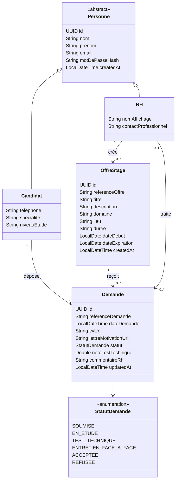

# Diagramme de classes métier

Ce diagramme est dérivé des entités JPA actuellement implémentées.

## Règles associées

- `Personne` utilise l'héritage JPA `JOINED` avec `Candidat` et `RH`.
- L'email est unique pour tous les types de personne.
- Une offre appartient à un RH créateur.
- Une demande appartient à un candidat et une offre.
- Le RH traitant reste optionnel tant que la demande n'a pas été traitée.
- Le couple candidat/offre est rendu unique par une vérification métier.

L'image historique reste disponible dans [diagramme-classes.png](./diagramme-classes.png), mais le diagramme Mermaid ci-dessus correspond au code actuel.
